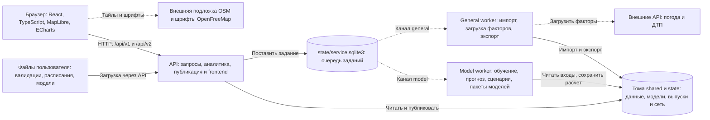
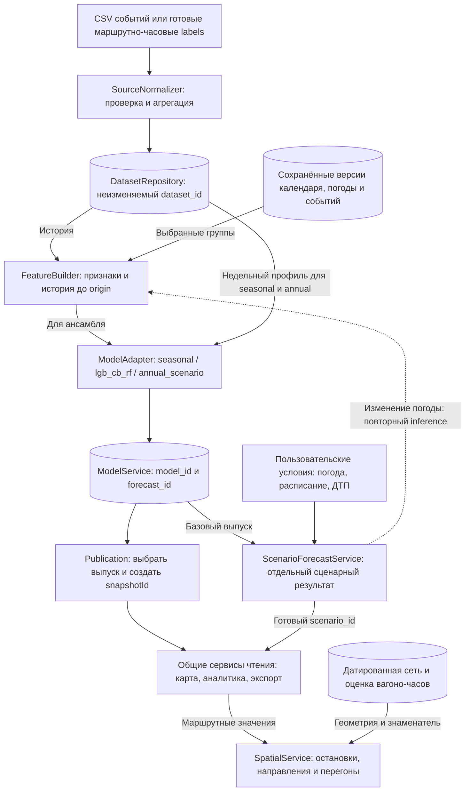

# «Поток»: архитектура, область определения и адаптация модели

Описание текущей реализации на 27.09.2026. Основание — код backend и frontend, конфигурация поставки и сохранённые отчёты проекта. Схемы ниже описывают работающие компоненты; предложения по переносу модели обозначены отдельно.

«Поток» прогнозирует **число успешных валидаций на маршруте за час** и позволяет сравнивать сценарии погоды и движения. Маршрутный прогноз, сценарный пересчёт и пространственная оценка — три разных этапа. Значения на остановках и перегонах получаются из распределительных допущений: они не измеряют число людей в салоне.

## 1. Архитектура исполнения

Приложение построено как модульный backend с отдельными процессами для длительных заданий. Основная поставка — один контейнер с API и двумя worker-процессами, общими томами и лимитом 4 vCPU / 4 ГиБ RAM. Распределённой очереди и отдельных микросервисов в этой схеме нет.

[Схема в SVG](diagrams/architecture.svg) · [исходник Mermaid](diagrams/architecture.mmd).

Стрелки подписаны действием; пунктир выделяет выдачу заданий worker-процессам и обращения к внешним источникам. Результаты и статусы заданий читаются через API. SQLite очереди физически находится в томе `state`, но показана отдельно от файлов результатов.

- **HTTP-процесс** отдаёт собранный frontend и обслуживает аналитику по сохранённым данным. Обучение, выпуск прогноза и пересчёт сценария выполняются в канале `model`. Расчёт представления карты и пространственных показателей может выполняться при чтении через общие расчётные сервисы.
- **General worker** обрабатывает предварительную проверку и применение импорта, расписания, загрузку факторов, CSV/Parquet и архивы. Он также обслуживает совместимую очередь экспортов v1.
- **Model worker** обрабатывает обучение, прогноз, сценарии, импорт/экспорт моделей и изменение весов ансамбля. Каждое v2-задание запускается в дочернем процессе.
- **Хранение** разделено на `shared` — `catalog.sqlite3`, исходные файлы, канонические данные и внешние версии; `state` — `service.sqlite3`, модели, выпуски, география, сценарии, экспорты и текущий снимок. SQLite работает в режиме WAL; файлы записываются атомарно, описание версии публикуется после данных.
- **Надёжность** обеспечивают `Idempotency-Key`, владелец задания, продлеваемый lease на 30 секунд и восстановление просроченных заданий, максимум до трёх попыток. Для публикации поддержана проверка ожидаемого снимка. Архитектура рассчитана на один хост и общую файловую систему.

За запуск процессов отвечает [standalone.py](../backend/src/moscowt/standalone.py), за ресурсы — [compose.single.yaml](../compose.single.yaml). Альтернативный [compose.yaml](../compose.yaml) разносит API и два worker по трём контейнерам с другими лимитами. Backend использует Python 3.12, FastAPI/Pydantic, pandas/PyArrow и ML-библиотеки; версии зафиксированы в `backend/uv.lock`. Frontend собирается Vite; зависимости закреплены в `frontend/package-lock.json`.

## 2. Модули и поток расчёта

[Схема в SVG](diagrams/model-flow.svg) · [исходник Mermaid](diagrams/model-flow.mmd).

Схема показывает логические зависимости модулей, а не отдельные процессы. Пространственный расчёт вызывается общими сервисами чтения для карты и экспорта; маршрутные значения остаются исходной основой. При изменении погоды сценарный сервис вызывает `ModelService.predict(..., persist=False)`: признаки пересчитываются, деревья используются уже обученные.

| Модуль | Файлы / классы | Ответственность и результат |
|---|---|---|
| Интерфейс | `frontend/src/App.tsx`, `components/`, `lib/usePlatform.ts`, `lib/api.ts`, `lib/platform.ts` | Карта, данные, модели, сценарии и выгрузка; отправка команд и наблюдение за заданиями |
| API и контракты | `api.py`, `platform_api.py`, `domain.py`, `wire.py` | Проверка параметров; v1 — контракт карты и совместимости, v2 — управление платформой |
| Приём и каталог | `data/normalization.py`, `data/repository.py`, `data/catalog.py`, `data/schemas.py` | Потоковое чтение CSV, preview/apply, контроль конфликтов и полноты, новая редакция данных |
| Внешние факторы | `external.py`, `factors.py`, `service_calendar.py` | Архивы погоды, выпуски прогноза погоды, календарь, события, ДТП и их привязка к сети |
| Признаки | `modeling/features.py` / `FeatureBuilder` | Одинаковая схема признаков при обучении и применении; фиксированный origin для исторических признаков |
| Модели | `modeling/contracts.py`, `adapters.py`, `service.py` | Контракт `fit/predict`, проверка применимости, обучение, прогноз и паспорт артефакта |
| Перенос моделей | `modeling/packages.py` | Проверка ZIP с CB/LGB/skops/JSON, импорт, экспорт, новая версия весов ансамбля |
| Сценарии | `scenarios.py`, `scenario_engine.py` | Черновик, погодный inference, изменение движения и отдельный сохранённый результат |
| Движение и вагоны | `schedules.py`, `fleet.py` | Интервалы работы, назначения вагонов, конфликты и оценка вагоно-часов |
| Пространство | `geography.py`, `network_history.py`, `route_imports.py`, `spatial.py` | Датированная сеть, CSV-переопределения, условные поездки и нагрузка на перегоны |
| Публикация и чтение | `publication.py`, `analytics.py`, `platform_exports.py` | Связать выпуск со снимком; согласованно читать историю, прогноз, сценарий и экспорт |
| Выполнение и хранение | `tasks.py`, `platform_worker.py`, `storage.py`, `bundles.py` | Очередь, отмена, атомарная запись, контрольные суммы, перенос готового состояния |

Пути backend в таблице даны относительно [`backend/src/moscowt/`](../backend/src/moscowt/). Старые `forecasting.py`, `pipelines.py`, `jobs.py`, `worker.py`, `exports.py` обслуживают прежний конкурсный/v1-контур; основная адаптируемая модель находится в `modeling/`.

## 3. Область определения модели

### Целевая величина и вход

Для маршрута `r` и московского календарного часа `t` целевая величина:

`y(r, t) = число событий с validation_result = 1 на маршруте r за час t`.

При импорте готовых labels поле `boardings` принимается в том же смысле. Это счётчик успешных операций в предоставленной выборке; он не равен автоматически числу уникальных пассажиров, поездок или людей внутри вагона.

Вход прогнозирования — `(model_id, dataset_id, origin, [start, end), route_ids, внешние версии)`. Выход — полная таблица `route, timestamp, value` с одним конечным неотрицательным значением на каждый выбранный маршрут и час. Прогноз может быть дробным. Суточные и месячные объёмы получаются суммированием почасовых оценок.

| Измерение | Допустимая область текущего сервиса |
|---|---|
| Пространство | Маршруты с историей в выбранном наборе, включённые в обучение конкретной модели. Исследованная поставка: московский трамвай, № 1, 5, 7, 11, 12, 17, 25, 26, 28, 50 |
| Время | Часовой пояс `Europe/Moscow`; границы по целому часу, интервал `[start, end)`, `start ≥ origin`, конец обучения `≤ origin` |
| Горизонт | `seasonal` и `lgb_cb_rf`: конец окна не позднее 62 суток от origin; `annual_scenario`: до 366 суток при стандартной настройке `max_forecast_hours` |
| История | Не менее 21 дня для `seasonal`, 56 дней для ансамбля и годового адаптера; для каждого маршрута нужны все 168 сочетаний дня недели и часа, минимум по три известных наблюдения |
| Версия данных | `dataset_id` прогноза совпадает с версией обучения. Новая редакция требует новой модели |
| Пропуски | Неизвестное наблюдение хранится как `null`. Ноль допустим как известный результат; `complete=true` — явное утверждение полноты выбранного источника |
| Внешние признаки | Группы погоды, событий и ДТП поддерживает ансамбль; требуются соответствующие сохранённые версии данных |
| Результат | Неотрицательный маршрутно-часовой прогноз. Отдельные пространственные оценки требуют пригодной сети и знаменателя |

Проверки реализованы в [контрактах](../backend/src/moscowt/modeling/contracts.py), [ModelService](../backend/src/moscowt/modeling/service.py) и [TimeRange](../backend/src/moscowt/domain.py). При нарушении условий сервис возвращает объяснимую ошибку, например `INSUFFICIENT_HISTORY`, `ROUTE_NOT_TRAINED`, `MODEL_DATASET_MISMATCH`, `FUTURE_TRAINING_DATA` или `HORIZON_UNSUPPORTED`.

Эти ограничения задают техническую допустимость запроса, а не гарантию точности. Исходные labels покрывают январь–октябрь 2025 года. У маршрута № 5 нет положительной истории; численно допустимый прогноз для него не подтверждает переносимость модели. Допустимые диапазоны пользовательской погоды тоже не являются областью подтверждённого качества: выход за сохранённые диапазоны обучающих погодных признаков вызывает предупреждение.

### Три модельных адаптера

| Адаптер | Расчёт | Назначение и ограничение |
|---|---|---|
| `seasonal` | Среднее по маршруту, дню недели и часу за последние 56 дней до origin | Прозрачный недельный базовый прогноз; погодных ML-признаков нет |
| `lgb_cb_rf` | `max(0; 0,7 × CatBoost + 0,1 × LightGBM + 0,2 × RandomForest)` | Основной обучаемый ансамбль; веса могут сохраняться новой версией |
| `annual_scenario` | Недельный профиль последних 56 дней с календарным сопоставлением дней | Длинный сценарий; годовая сезонность на неполном годе не обучается, качество годового горизонта не валидировано |

Ансамбль использует код маршрута, час, день недели, циклические временные признаки, выбранную календарную группу, исторические аналоги и внешние признаки выбранного рецепта. Историческая часть включает лаги 24/168/336/672 часа, средние и стандартные отклонения за 7/14/28 дней, среднее маршрута за 30 дней. Для будущих часов эти значения берутся относительно последнего доступного аналога того же дня недели и часа до origin; будущие истинные значения не подставляются.

Обучающие примеры строятся семидневными блоками после первых 28 дней истории. Для исторических признаков каждого блока действует собственный фиксированный origin. В почасовом погодном рецепте и группе ДТП фактические условия используются для обучающего блока; при применении их заменяют доступные прогнозные/сценарные значения. Поэтому отсутствие утечки будущей целевой величины само по себе не устраняет различие между условиями обучения и эксплуатации.

Параметры полного сервисного рецепта: CatBoost/LightGBM/RandomForest — 1378/332/300 деревьев. Демонстрационный погодный рецепт и последний факторный эксперимент используют 144/96/64. Их результаты качества следует читать отдельно.

## 4. Адаптация модели

### Что адаптировано из конкурсного решения

Состав ансамбля и исходные веса сохранены. Конкурсный скрипт оставлен отдельно в [models/lgb_cb_rf/vendor/original.py](../models/lgb_cb_rf/vendor/original.py); сервис использует собственный `FeatureBuilder` и адаптеры. Обучение вынесено из HTTP-процесса, признаки ограничены origin, добавлены версии данных и моделей, проверка новых маршрутов, паспорт применимости и переносимые пакеты. Специальное обнуление маршрута № 5 и конкурсные исключения ночных часов в общий сервис не перенесены.

Исходный конкурсный скрипт выполнен отдельно, но точного числового совпадения с предоставленным эталоном не достигнуто. Поэтому сервисная адаптация не объявляется побитовым воспроизведением исходного решения; подробности — в [отчёте воспроизведения](../models/lgb_cb_rf/README.md).

### Как изменять модель в текущем сервисе

1. **Обновить историю.** Загрузить события или labels, проверить preview, применить `append`, `upsert` либо `replace`. Результат — новая неизменяемая редакция `dataset_id` с покрытием и контрольными суммами.
2. **Выбрать область обучения.** Указать маршруты, период, адаптер, параметры и версии внешних факторов. Новый маршрут требует пригодной собственной истории; одной геометрии для обучения недостаточно.
3. **Обучить модель.** Канал `model` создаёт `model_id`, артефакт и паспорт: рецепт, seed, версии библиотек, хеши кода, состав данных, покрытие маршрутов и диапазоны погодных признаков.
4. **Проверить на следующих по времени окнах.** Сравнить с сезонной базой по WAPE, MAE, смещению, маршрутам и суммам; отдельно проверить пропуски и режим доступности факторов. Новые условия переноса требуют новых фактов для независимой проверки.
5. **Выпустить прогноз и опубликовать его.** `forecast_id` фиксирует модель, данные, origin и окно; отдельная публикация создаёт `snapshotId`. Обучение или импорт данных сами по себе карту не переключают.

Изменение только весов ансамбля создаёт новую модель без повторного обучения деревьев; веса неотрицательны и в сумме равны единице. Выбранный выпуск можно пересчитать для новой версии. Изменение состава признаков требует обучения совместимой модели. HTTP принимает проверяемые модельные пакеты; конвертация доверенных joblib/pickle выполняется отдельным локальным скриптом.

Автоматического дообучения на каждом поступившем событии нет. Для переноса на другой город или вид транспорта потребуется дополнительно адаптировать часовой пояс, календарь, источники погоды, географию и правила пространственного распределения, затем переобучить и проверить модель. Такой перенос в текущих экспериментах не подтверждён.

### Сценарная адаптация без обучения

Пользовательские температура, влажность и осадки заменяют признаки выбранных часов и проходят через обученный погодный ансамбль. Изменения расписания и ДТП применяются отдельной функцией реакции спроса:

`y_scenario = y_weather × q^ε × k_weather × k_event × k_season`, если `q > 0`; при `q = 0` результат равен нулю.

Здесь `q` — отношение новой частоты движения к базовой с учётом часов работы и доступности при ДТП; `ε` — заданная эластичность, по умолчанию 0,3; `k_*` — ручные коэффициенты, по умолчанию 1. Ручной `k_weather` отличается от изменения температуры внутри ML-модели. При одновременных ограничениях учитывается сильнейшее ограничение на каждом временном отрезке, затем результат интегрируется по времени работы.

Например, изменение интервала с 10 до 8 минут при остальных нейтральных условиях даёт `q = 10/8` и множитель `(10/8)^0,3 ≈ 1,0692`. Это следствие выбранного допущения об эластичности, а не измеренный причинный эффект расписания. Сценарий хранится отдельно, читается после завершения задания и проверки checksum; исходный выпуск сохраняется.

### Пространственная адаптация

`SpatialService` распределяет маршрутный объём по возможным парам остановок одного направления. Используются порядок остановок, длина пути, веса пересадочных узлов и утренний/вечерний профиль. Доли условных поездок суммируются в единицу; поток перегона включает все условные поездки, проходящие через него. Поэтому потоки последовательных перегонов нельзя складывать как независимые посадки.

Интенсивность окна рассчитывается как `сумма модельного потока / сумма вагоно-часов`. При неизвестном или нулевом знаменателе числовая оценка отсутствует. Неполная география ограничивает пространственный расчёт, но не отменяет маршрутный прогноз. Для перехода от допущений к проверяемой остановочной модели нужны наблюдения посадок/высадок либо GPS вместе с историческими рейсами и подтверждённой связью идентификаторов. Подробные веса и правила — в [методике участков](SECTION_MODEL.md).

## 5. Зависимости от внешних данных

| Данные / источник | Где используются | Обязательность и правило времени | Что происходит при отсутствии / ограничение |
|---|---|---|---|
| События валидаций или labels пользователя | Целевая величина, исторические признаки, обучение | Обязательны; история до origin, та же редакция, что у модели | Недостаток истории блокирует обучение/прогноз. Полнота исходной выборки не доказывает полноту пассажиропотока |
| Производственный календарь РФ, `holidays`, курируемые даты публикации | Календарные признаки и сопоставление дней годового профиля | Выбранная календарная группа; переносы выходных учитываются с проверкой доступности | Подтверждённого школьного календаря нет, `is_school_holiday=0`. За областью опубликованного календаря годовой профиль имеет сценарный статус |
| Open-Meteo / ERA5: почасовой архив 2024–2025, одна ячейка Москвы | Температура, относительная влажность, осадки в ансамбле | Нужен для почасового погодного рецепта; обычный прогноз использует климатологию завершённых до origin лет | Нет покрытия — ошибка `WEATHER_COVERAGE_MISSING`. Фактическая погода будущего окна допускается только в диагностике |
| Суточный архив ERA5 2014 — сентябрь 2025 | Климатологические признаки прежних погодных рецептов | Альтернативный путь через `external_snapshot_id`; используются завершённые до origin годы | Требуется покрытие всех целевых дат. Суточный архив не заменяет почасовую влажность для нового погодного сценария |
| Сохранённый выпуск Open-Meteo Forecast | Замена климатологии оперативной погодой | Необязателен; `available_at ≤ origin`, покрытие всех часов, горизонт не более суток от origin | Поздний/неполный выпуск отклоняется. Архивный hindcast не считается автоматически доступным в прошлом прогнозом |
| «Карта ДТП»: 8 354 события Москвы за 2025 год | Обучающие счётчики за 1/3 часа, диагностика, кандидаты пространственного влияния | Нужен для группы `accidents`; привязка к датированной сети в радиусе 100 м | В оперативном режиме будущие счётчики и флаг покрытия равны нулю: это кодирование неизвестного будущего. Время публикации и длительность перекрытия неизвестны |
| Курируемые сообщения об изменении движения | Дополнительная группа `events` ансамбля | Нужна внешняя версия; учитывается доступность сообщения до origin | Покрытие ограничено выбранными сообщениями; неизвестные будущие события не добавляются |
| Историческая география OSM / Overpass и CSV пользователя | Карта, порядок остановок, участки, привязка ДТП | Для маршрутного прогноза необязательна; нужна для соответствующих пространственных операций | Разорванные направления не подменяются прямой. История OSM не доказывает фактическое движение на каждый день; CSV действует в явном периоде |
| Расписания, назначения вагонов, наблюдаемая активность | Частота движения, вагоно-часы, знаменатель интенсивности и сценарии | Для прогноза валидаций необязательны; нужны для обоснованного расчёта движения | Сентябрьское расписание 2026 покрывает девять маршрутов без номеров вагонов/выходов. Перенос на 2025 разрешается только явно как сценарий |
| Дорожные скорости / пробки | В текущую модель не включены | Пригодного маршрутно-часового архива за нужный период в проекте нет | Эффект дорожного трафика не оценивается; текущие новости не подменяют исторические измерения |
| Тайлы OSM и шрифты OpenFreeMap | Подложка карты в браузере | Сетевая зависимость отображения, отделённая от ML | Недоступность может нарушить отображение подложки/подписей; сохранённые расчёты не зависят от этих запросов |

Точные источники, покрытия, запросы и прежние эксперименты перечислены в [реестре внешних источников](EXTERNAL_SOURCES.md), [паспорте географии](../dataset/geography/README.md) и [методике вагонов](../dataset/derived/fleet/README.md). Активность вагонов, выведенная из тех же валидаций, не является независимым подтверждением эффекта расписания.

### Доступность данных и воспроизводимость

Загрузка погоды и ДТП выполняется отдельными заданиями; география подготавливается скриптами/CLI. **При вычислении прогноза сетевых обращений к поставщикам данных нет.** После подготовки комплект работает на сохранённых версиях. Новая загрузка сохраняет исходный ответ, метаданные и checksum; паспорт модели фиксирует выбранные идентификаторы. Поэтому доступность внешнего сайта при повторном расчёте и полнота сохранённой версии — разные условия.

Историческая проверка в проекте имеет политику `retrospective_event_time`: целевая история ограничена временем события. Это не полная реконструкция того, когда каждая запись фактически поступила оператору. ERA5 и архив ДТП получены позднее исследуемого периода; наличие их ретроспективных фактов не доказывает доступность этих фактов в 2025 году. Для сохранённого оперативного прогноза погоды используется консервативная граница `available_at`, равная времени получения. Диагностический прогноз с фактическими внешними условиями окна нельзя опубликовать как оперативный.

## 6. Что подтверждено проверками

Для полного сервисного ансамбля WAPE месячного почасового прогноза составила 0,15755 за сентябрь и 0,09553 за октябрь 2025; для сезонной базы — 0,21813 и 0,14033. Это результаты фиксированных origin 01.09 и 01.10.2025 из [model-validation.json](model-validation.json). Периоды использовались в исследованиях и не являются независимым holdout.

В отдельном факторном сравнении рецепта 144/96/64 на июне, сентябре и октябре календарная группа снизила среднюю WAPE на 1,832 процентного пункта. Погода увеличила ошибку на 0,129 п.п., ДТП — на 0,055 п.п. Следовательно, наличие этих интеграций не подтверждает улучшения оперативного качества. Методика, MAE, смещение и разделение оперативного/ретроспективного режимов приведены в [FACTOR_RESULTS.md](FACTOR_RESULTS.md).

Остановочные значения, пространственные потоки, реакция на расписание/ДТП и годовой горизонт пока требуют независимой проверки. Сценарные диапазоны не являются доверительными интервалами. Для оценки переполненности потребуются также вместимость вагонов и данные о посадках/высадках.

Связанные материалы: [пользовательские сценарии](SCENARIOS.md), [форматы и эксплуатация backend](../backend/README.md), [API](../frontend/API.md), [валидация](VALIDATION.md), [производительность](PERFORMANCE.md).
