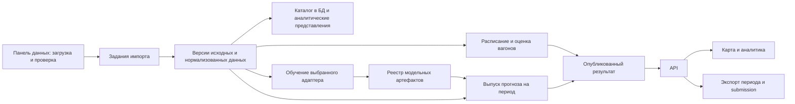

# План развития «Потока»: данные, модели, расписания и экспорт

Дата: 26 сентября 2026 года. Статус: план реализации по 12 пунктам пользователя. Этот документ не утверждает, что перечисленные изменения уже выполнены. На этапе подготовки плана код приложения и исходные данные не изменялись.

**Цель.** Пользователь добавляет маршрут, историю за новый месяц и расписание; выбирает обучающую выборку, модель и период прогноза; получает воспроизводимый прогноз через API, карту и экспорт. Модель и её обучение заменяются через единый контракт. Конкурсный submission остаётся отдельным воспроизводимым результатом.

**Что проверено в текущем окружении**

- Приложение находится в `/home/trias/work/hack/moscowT/MoscowT`. Основные ограничения зашиты в `backend/src/moscowt/domain.py`, `pipelines.py`, `forecasting.py`, `analytics.py`, `fleet.py`, `route_imports.py` и `exports.py`: десять маршрутов, история 2025 года, прогноз до 61 дня, матрицы фиксированной формы.
- Исходные CSV и labels доступны рядом, в `/home/trias/work/hack/moscowT/dataset`. Суммарный размер raw CSV — около 9,7 ГиБ. Отсутствие этих файлов внутри каталога приложения не означает отсутствие источников на машине.
- Под обозначением пользователя `LGB_CB` в плане принят найденный каталог `/home/trias/work/hack/moscowT/LGB_CB_RF_ensemble/LGB_CB_RF_ensemble`. Он содержит `06_submission_LGB_CB_RF.py`, `features_v4.parquet` и `submission.csv`. Это локальная поставка, наличие отдельного Git-репозитория не подтвердилось.
- Исходный ансамбль: CatBoost 0,7 + LightGBM 0,1 + Random Forest 0,2. Скрипт обучает модели при запуске, использует фиксированные даты, отдельную подготовку будущих признаков через октябрьские аналоги, исключает № 5 из обучения и обнуляет его прогноз. Есть ночные ограничения и специальная обработка 3 ноября 2025 года.
- SHA-256 исходного скрипта: `ac131522b088e8b8b4dc8968894838f7b94818fdf7df43cddb22e69008e502dc`.
- Фактически прочитан `/home/trias/work/hack/moscowT/dataset/test_submission.csv`: четыре колонки `route;date;hour;prediction`, 14 640 уникальных ключей, десять маршрутов, 01.11–31.12.2025. SHA-256: `71c8126bb51068c936462a170da885bad860fc91a58b3d2ac731876d324d7ec3`.
- Внутри приложения сохранён частичный архив расписаний. Его `summary.json` сообщает 0 полностью покрытых маршрутных суток и 1 частично покрытые. По существующему описанию Excel, лист «Расписание» содержит фрагмент одного рейса № 1, а «Наряд» относится к февралю 2026 года. Эти источники не доказывают расписание всего 2025 года. Путь к новому расписанию из пункта 7 запрошен у пользователя; конкретный импортёр уточняется после получения файла.
- В соседнем `experiments/` есть дополнительные исследования. Их можно использовать как справочные наработки после проверки зависимостей; они не заменяют выбранный пользователем ансамбль автоматически.

**Целевая схема**



Единица числового результата — маршрут и календарный час Europe/Moscow. Целевая величина остаётся числом успешных валидаций. Для расчёта «на вагон в час» добавляются вагоно-часы и метод их получения. Дата события, дата загрузки, момент выпуска прогноза и дата создания артефакта — разные поля.

**Этап 1. Общая область данных и каталог маршрутов — пункты 2, 3, 4**

Ввести настраиваемый `MOSCOWT_DATA_ROOT`, отдельный от кода и `MOSCOWT_STATE_DIR`. На первом переходе подключать найденные исходники по абсолютному пути только для чтения; существующие производные данные переносить с манифестами. Не копировать raw CSV в Docker image. Подготавливаемые данные хранить на постоянном общем томе.

Предлагаемое устройство общего каталога:

```text
data/
  incoming/<upload_id>/                 временные загружаемые файлы
  raw/<source>/<file_hash>/             неизменяемые исходники
  canonical/<dataset_id>/               нормализованные таблицы и манифест
    validations/year=YYYY/month=MM/     события, если загружен raw
    route_hours/year=YYYY/month=MM/     target и признаки полноты
    schedules/                         рейсы, выходы, остановочные времена
    assignments/                       назначения вагонов и их происхождение
  features/<feature_version>/<key>/     производный кэш признаков
state/
  service.sqlite3                      каталог, задания, публикации
  models/<model_id>/                    сериализованные модели и manifest
  forecasts/<forecast_id>/              почасовые предсказания
  fleets/<fleet_id>/                    расчёт вагоно-часов
  snapshots/<snapshot_id>/              согласованные ссылки на версии
  exports/                             готовые выгрузки
```

Канонические таблицы Parquet — общий числовой источник. БД хранит каталог файлов, версии, покрытие и связи; если нужны SQL-таблицы с числовыми данными, они строятся как восстанавливаемые проекции конкретного `dataset_id`. Обучение и запросы к БД должны ссылаться на одну опубликованную версию, а не независимо читать «последний CSV».

Добавить реестры маршрутов и их версий: устойчивый внутренний ID, публичный номер, период существования, геометрия, доступная история и статус обучения. Номер, геометрическая версия и модельное покрытие не должны быть одним признаком. Убрать десять маршрутов и 2025 год из общей валидации, reshape матриц, календаря интерфейса, импортов и fleet. Сохранить их только в конкурсном профиле. Лимиты размера запросов оставить настраиваемыми.

Для нового маршрута предусмотреть состояния «только геометрия», «есть история», «готов к обучению», «есть модель». До появления достаточной истории прогноз недоступен с понятной причиной; нельзя автоматически присваивать нулевой поток. Сначала поддержать переобучение общего ансамбля с новым маршрутом. Контракт дополнительно допускает модели по маршрутам; отдельная такая модель не обязательна для первого рабочего выпуска.

**Приёмка:** новый маршрут добавляется без правки Python/TypeScript-констант; две службы читают один `dataset_id`; старые снимки продолжают открываться; данные до начала работы маршрута не становятся автоматически нулями.

**Этап 2. Импорт месячных данных и пересчёт — пункты 3, 4, 11, 12**

Предусмотреть два типа истории: готовые почасовые labels и сырые события. Labels достаточно для обучения target, но без raw или назначений они не позволяют проверить `garage_number` и `bus_exit_no`. Raw читать порциями. Идентификаторы сохранять строками с исходным значением; нормализацию вести отдельными полями.

Операция импорта: загрузка → предварительная проверка → отчёт по датам, маршрутам, пропускам и конфликтам → публикация новой версии. Пользователь отдельно выбирает период включения в датасет. Фактические даты определяются по timestamp событий, включая месячные «хвосты», а не по имени файла.

Режимы: добавление нового месяца и исправление существующего периода. Полная замена месячного раздела и частичное обновление имеют разные правила; отсутствие строки в частичном файле не означает её удаление. Повтор того же файла определяется по хешу и параметрам операции. Конфликтующие почасовые значения не суммируются автоматически. Labels и агрегат из raw для одного ключа сверяются, а не складываются. Пара `(device_no, tran_no)` не принимается без проверки как глобальный ключ дедупликации.

Пропуски заполняются нулём только при подтверждённой полноте данного источника и периода работы маршрута. В остальных случаях сохраняются `missing` и статус покрытия. Проверки нынешнего конкурсного набора остаются профилем импорта, а не универсальным правилом будущих месяцев.

После публикации строить список зависимых расчётов: агрегаты, признаки, статистика вагонов, модели и прогнозы. Для лагов пересчитывать также зависимые последующие окна; для глобальных статистик или общего ансамбля пересчёт может затронуть все маршруты. Старые результаты сохранять. Ввести действие «Пересчитать» и отдельную настраиваемую политику автоматического пересчёта. Новый результат становится текущим только после успешных проверок; ошибка обучения не заменяет работающий снимок.

**Приёмка:** добавление месяца расширяет историю; повторный импорт не меняет суммы; исправление создаёт новую версию; пересчёт использует новый месяц и оставляет доступным предыдущий прогноз; отклонённый импорт не меняет текущие данные.

**Этап 3. Заменяемые модели, обучение и прогнозные периоды — пункты 1, 2, 5**

Вынести подготовку признаков, обучение, оценку, сохранение и прогноз из монолитного `forecasting.py`. Предлагаемый контракт:

```python
capabilities() -> ModelCapabilities
fit(dataset_ref, training_spec) -> ModelArtifact
predict(model_artifact, dataset_ref, forecast_spec) -> ForecastArtifact
evaluate(forecast_ref, truth_ref) -> EvaluationReport
save(model, destination) -> Manifest
load(model_ref) -> Model
```

`TrainingSpec`: модель и версия рецепта, маршруты, интервал истории, cutoff, параметры, seed. `ForecastSpec`: `origin`, `[start, end)`, маршруты, почасовая сетка. `ModelCapabilities`: допустимые горизонты, минимальная история, поддерживаемые маршруты и необходимость переобучения при новом origin. API не обещает горизонт, который адаптер не поддерживает.

Разделить выборку уже рассчитанного периода и создание нового выпуска. Пользователь может запросить день, неделю, календарный месяц или произвольный интервал внутри допустимого горизонта. Агрегация по дням — сумма почасовых предсказаний. При новом периоде обучения или origin создавать отдельный model/forecast ID; при чтении готового подинтервала переобучение не требуется. Годовой горизонт не объявлять качественно проверенным без отдельного эксперимента.

Все источники признаков ограничиваются моментом выпуска. Факт из прогнозируемого окна нельзя подставлять в лаг только потому, что он уже есть в текущей БД. При прогнозе с промежутком между origin и start рекурсивный адаптер должен пройти промежуточные шаги, если они нужны его алгоритму. В отсутствие надёжного журнала поступлений оценка по исходным данным маркируется как ретроспективная по времени событий.

`model_id` связывает код, feature schema, гиперпараметры, версии библиотек, набор маршрутов, training cutoff и `dataset_id`. `forecast_id` дополнительно фиксирует origin и сетку. Кэш признаков учитывает cutoff; файл из полного года нельзя переиспользовать в раннем backtest без проверки доступности каждого признака.

Маршрут № 5 перестаёт иметь безусловный ноль в общем сервисе. Старая политика сохраняется в версии конкурсного рецепта; при появлении его положительной истории сервис должен допускать обучение. Для остальных новых маршрутов также нужна явно описанная политика недостаточной истории.

**Приёмка:** текущий сезонный эксперт и выбранный ансамбль работают через один контракт; смена адаптера не требует изменений API, карты и экспорта; новый маршрут входит в обучение; запрос другого месяца не использует факты этого месяца; сохранённая модель после загрузки воспроизводит предсказания.

**Этап 4. Перенос LGB/CB/RF и Docker — пункт 6**

Скопировать исходный скрипт в проект как версионируемый источник, например `models/lgb_cb_rf/vendor/`, с путём происхождения и SHA-256; `__MACOSX` не переносить. `features_v4.parquet` и эталонный CSV зарегистрировать в общей области данных. Рабочий адаптер разместить отдельно, чтобы были видны изменения относительно исходного алгоритма.

Сначала воспроизвести исходный конкурсный запуск в контейнере: зависимости и seed зафиксированы, входы смонтированы read-only, вывод направлен в отдельный каталог. Сравнить ключи, целочисленные прогнозы, суммы и контрольные суммы с предоставленным результатом. Расхождения из-за окружения или входов зафиксировать до рефакторинга. Код не запускать простым import: у исходника обучение выполняется на верхнем уровне.

Затем выделить функции fit/predict и сериализацию трёх моделей, весов, признаков и постобработки. В первой версии сохранить состав ансамбля 0,7/0,1/0,2. Произвольные периоды требуют нового версионируемого рецепта: октябрьский аналог обобщить до исторических аналогов, доступных перед origin; календарь получать для выбранного периода. Одноразовые правила 3 ноября, ночные ограничения и нулевой маршрут вынести в явную конфигурацию с областью действия.

Готовый `features_v4.parquet` не считать вечным источником будущих месяцев. Нужен воспроизводимый feature builder из канонической истории. Проверить 34 используемых признака, особенно лаги, rolling, `route_mean_30`, `holiday_streak` и школьный календарь. Обучение и прогноз должны использовать согласованные определения. Изменение формул означает новую версию модели, а не обещание побитового совпадения с исходным CSV.

Локальная проверка исходника использует готовые признаки октябрьских строк; это само по себе не доказывает качество фиксированного прогноза из 1 октября. Ввести исторические выпуски с тем же построением признаков, что в production, и отдельными окнами для настройки и оценки. Сравнивать выбранный ансамбль с сезонным baseline по общей и маршрутной WAPE, не подменяя модель автоматически результатом стороннего эксперимента.

Предлагаемые Docker-службы: `api` для чтения и постановки задач, `worker` для импорта/экспорта, `model-worker` для обучения и инференса. Для локального сервиса достаточно общей SQLite-очереди с типами заданий и корректным владением задачей; не требуется сразу вводить брокер. Обучение выполнять вне HTTP-процесса. Число потоков, память и параллельность задавать конфигурацией, убрав `n_jobs=-1` и `thread_count=-1`. Нынешний лимит приложения 2 ГБ не считать доказанно достаточным для ансамбля с RF: измерить пик памяти и время отдельно.

Моделям давать read-only доступ к опубликованным данным и запись в собственный временный каталог; публикацию выполнять атомарно через worker. При прерывании использовать heartbeat/lease, состояние задания и проверку готового артефакта. Поддержать повторный запуск и кооперативную отмену. На первом этапе сериализовать тяжёлые операции. Приложение открывает готовую модель без повторного обучения при старте контейнера.

**Приёмка:** clean Docker build; воспроизведение исходного запуска; train → save → restart → predict; произвольный поддерживаемый период; прогноз API остаётся доступным во время обучения; измерены время и RAM; сбой не публикует частичный результат.

**Этап 5. Плановый выпуск, наблюдения и интенсивность — пункт 7**

Расписание описывает план. Оно не подтверждает прибытие конкретного вагона в конкретный день. Поэтому отдельно хранить плановые вагоно-часы, оценку активности по событиям и, когда хватает данных, прогноз исполнения плана. В API и на карте должен быть указан выбранный метод знаменателя.

Нормализовать расписание в маршруты, календарь обслуживания и исключения, рейсы, направления, остановочные времена, выходы/графики и смены. Нужны сроки действия версии, `service_id`, `trip_num`, `grafic`, плановые начало/конец и связь с маршрутом. Остановочные строки одного рейса не считаются отдельными рейсами или вагонами. Время после полуночи и значения вида `25:10` переводятся из служебного дня в московское календарное время. Неизвестные календарь действия или конец неполного рейса отмечаются явно.

Связь данных строить по маршруту, служебной дате и нормализованному выходу: `bus_exit_no` ↔ `grafic`; при необходимости учитывать смену, депо и период версии. `garage_number` использовать как идентификатор физического вагона и сопоставлять с бортовым номером в наряде только при подтверждённой связи на эту дату. Одного совпадения номера графика между месяцами или маршрутами недостаточно.

Для каждого выхода собрать интервалы работы на маршруте из рейсов и заданий. Объединять пересекающиеся интервалы одного выхода/вагона, учитывать завершение работы, разрывы, смену вагона и переходы между маршрутами. Межрейсовый отстой включать только по согласованному определению «на линии» и сведениям источника; длительные неизвестные разрывы автоматически не заполнять. Бортовые номера не суммируются с выходами: один и тот же ресурс должен учитываться один раз. Конфликт одновременного назначения вагона двум маршрутам требует флага качества, а не двойного счёта.

Если бортовой номер на будущую дату неизвестен, плановый выход служит единицей ресурса с маркировкой `planned_duty`, без выдуманного назначения вагона. Если расписание содержит только отправления без связи в выходы, точное число вагонов из него не следует: нужна дополнительная схема оборотов либо отдельно обозначенная оценка с собственными допущениями.

События с `garage_number` подтверждают активность в некоторые моменты, но отсутствие валидаций не доказывает отмену рейса. Использовать их для сверки плана, поиска замен вагонов и расчёта покрытия связей с `bus_exit_no`. Поправку к плану обучать только на прошлом и только при достаточном подтверждении источников; не выдавать коэффициент совпадений валидаций за измеренную вероятность выполнения рейса. В будущее нельзя переносить фактические назначения, полученные после origin.

Выбор знаменателя:

1. При полном применимом расписании — плановые вагоно-часы; дополнительно прогнозные, если проверена модель исполнения.
2. При частичном расписании — явное покрытие и отсутствие полной оценки либо отдельный исторический метод из событий. Частичный план не выдаётся за весь выпуск.
3. При отсутствии расписания — сохранённая оценка по активности/историческому профилю с соответствующей подписью. Это позволяет пользоваться системой до получения полного источника, но не закрывает приёмку расчёта по новому расписанию.

Для часового окна `H`:

```text
vehicle_hours(H) = сумма длительностей пересечения уникальных
                   интервалов работы ресурсов с H, в часах

mean_vehicles(period) = sum(vehicle_hours) / duration_hours(period)

validations_per_vehicle_hour(period) =
    sum(predicted_or_observed_validations) / sum(vehicle_hours)
```

Например, четыре вагона весь час и один полчаса дают 4,5 вагоно-часа. Для 180 валидаций интенсивность равна 40 на вагон в час. Для 12 часов или месяца сначала суммируются числитель и знаменатель; средние почасовые отношения не усредняются. Нулевой или неизвестный знаменатель даёт `null`; положительный поток при нулевом плане дополнительно получает флаг несогласованности.

Название метрики — «валидации на вагон в час», пока источник target остаётся прежним. Это не количество одновременно находящихся людей в салоне. Для направления использовать его плановые вагоно-часы, когда они доступны. В `sectionLoad.ts` заменить прежнее деление fleet пропорционально длинам направлений на новый знаменатель. Сценарное распределение пассажирского потока по перегонам по-прежнему маркировать как модельное; фильтры карты не меняют маршрутный прогноз.

Пороговые значения хранить в одной конфигурации backend и передавать клиенту через capabilities. Обновить карту, карточки, легенду, таблицы, экспорт и проверки границ:

| Интенсивность | Цвет |
|---|---|
| `0 ≤ x < 5` | Очень светлый зелёный |
| `5 ≤ x < 20` | Светлый зелёный |
| `20 ≤ x < 34` | Зелёный |
| `34 ≤ x < 50` | Жёлтый |
| `x ≥ 50` | Красный |
| `null` | Серый, нет оценки |

Таким образом, границы шкалы — `[5, 20, 34, 50]`, ноль является известным значением, а не пропуском.

**Приёмка:** проверены ночные переходы, смены, замены вагонов, частичные часы, повторяющиеся остановочные строки и конфликтующие назначения; один вагон с несколькими валидаторами не размножается; расчёт на контрольном полном расписании совпадает с ручным; источники знаменателя видны в API и CSV; границы 5/20/34/50 срабатывают точно. До получения применимого расписания этот этап можно подготовить, но нельзя объявить подтверждённым на реальных маршрутах.

**Этап 6. API и выполнение заданий — пункты 1, 3, 8, 12**

Предлагается новая версия API `/api/v2` с переходным адаптером для существующего интерфейса. Сначала зафиксировать схемы запросов и ответов, затем обновлять backend и Zod-контракты вместе. Схему OpenAPI генерировать из приложения и проверять на расхождения.

| Операция | Предлагаемый endpoint |
|---|---|
| Создать загрузку, посмотреть её проверку, опубликовать | `POST /uploads`, `GET /uploads/{id}`, `POST /uploads/{id}/apply` |
| Версии данных, покрытие, периоды | `GET /datasets`, `GET /datasets/{id}` |
| Добавить маршрут, увидеть историю и модельную готовность | `POST /routes`, `GET /routes/{id}` |
| Доступные адаптеры и обученные модели | `GET /model-types`, `GET /models` |
| Запустить обучение | `POST /training-runs` |
| Заказать новый выпуск на период | `POST /forecast-runs` |
| Состояние выпуска и чтение готового подинтервала | `GET /forecast-runs/{id}`, `GET /forecasts` |
| Задание, прогресс и отмена | `GET /jobs/{id}`, `POST /jobs/{id}/cancel` |
| Экспорт периода или конкурсного шаблона | `POST /exports`, `GET /exports/{id}/download` |

Большие файлы загружаются потоково в staging. Обучение, инференс, нормализация raw и крупные экспорты выполняются через очередь с ответом `202` и ID задания. Чтение готового прогноза не запускает незаметное обучение. Для тяжёлых операций нужны идемпотентность, прогресс по стадиям, лимиты, устойчивость к рестарту и понятные коды ошибок.

Ответ прогноза содержит ключи `route_id`, `timestamp`, значение, тип источника; метаданные `dataset_id`, `model_id`, `forecast_id`, `origin`, `training_end`, интервал, часовой пояс и версии признаков/географии/расписания/fleet. Для нагрузки — плановые или оценочные вагоно-часы, их метод и качество покрытия. Результат не должен смешивать данные разных выпусков без явного указания.

При выборе «прогноз» API возвращает именно сохранённый прогноз, даже если факты уже появились. Существующий режим «авто» может показывать факты при наличии и прогноз в остальных часах, но сохраняет происхождение каждой строки. Данные за выбранный период читаются независимо от дня, открытого на карте. Для крупных интервалов вводятся пагинация/потоковая выгрузка и настраиваемые ограничения.

**Приёмка:** новый клиент может запросить период, дождаться задания и получить прогноз; статусы переживают рестарт; неподдерживаемый маршрут/горизонт возвращает предметную ошибку; числовые значения совпадают с опубликованным артефактом; чтение старого выпуска не меняется после импорта нового месяца.

**Этап 7. Сворачиваемая панель данных и выбор периода — пункты 11, 12**

Вынести операции в отдельную сворачиваемую область «Данные и модели». Внутри — загрузки и их проверки, версии датасетов, маршруты и расписания, обучение/прогнозы, выгрузки и журнал заданий. Существующую загрузку геометрии включить как один из типов импорта. Выделить компоненты из большого `App.tsx`; основной экран карты остаётся рабочей областью анализа.

Разделить три независимых периода: импортируемый интервал, интервал обучения/cutoff и период прогноза/экспорта. Время на карте не должно незаметно определять все три. Добавить пресеты «сутки», «неделя», «месяц» и произвольные даты; показывать доступные диапазоны для маршрутов и выбранной модели.

Перед применением загрузки показывать распознанный тип, месяц, маршруты, число строк, покрытие, конфликты и последствия пересчёта. После публикации — кнопку обучения/пересчёта и прогресс. При добавлении маршрута пользователь видит, что уже есть: геометрия, история, расписание, модель. Выбор модели показывает её версию, дату обучения и поддерживаемый горизонт.

Сворачивание панели и обновление страницы не отменяют серверные задания. Состояние панели сохраняется отдельно от выбранного периода анализа. На мобильном экране панель открывается отдельной вкладкой/выдвижной областью; обеспечить клавиатурную навигацию и понятные ошибки загрузки.

**Приёмка:** весь цикл загрузки и выгрузки доступен в одной области; она сворачивается без потери задания; период выгрузки можно выбрать независимо от карты; после перезагрузки страницы отображается реальный статус серверной задачи.

**Этап 8. Экспорт и отдельный конкурсный профиль — пункты 9, 12**

Пользовательский экспорт: маршруты, независимый `[start, end)`, конкретный forecast/snapshot, почасовая или дневная агрегация, режим фактов/прогноза/авто. В CSV включить происхождение, версии данных и модели, знаменатель, метод fleet и метрику нагрузки. Для обмена данными и моделями предусмотреть выгрузку канонических таблиц в Parquet с manifest; доступ к исходникам оформить отдельной операцией, не смешивать с публичным CSV аналитики.

Конкурсный профиль `competition_2025_nov_dec` использует фактически имеющийся `test_submission.csv` только как шаблон ключей и порядка. Значения его `prediction` не являются обучающей разметкой. Результат: UTF-8, `;`, ровно четыре колонки `route;date;hour;prediction`, 14 640 уникальных строк без учёта заголовка, десять исходных маршрутов, часы 0–23, даты 01.11–31.12.2025, конечные неотрицательные прогнозы с задокументированным округлением.

Маршруты, добавленные для обычного сервиса, не расширяют конкурсный шаблон. Модель для этого профиля ограничена историей до 01.11.2025; загрузка более поздних месяцев не должна приводить к их использованию в конкурсном backtest или выпуске. При неполной сетке, неподходящем cutoff или несовместимой модели экспорт отклоняется с объяснением. Не дополнять неизвестные ключи молчаливыми нулями.

Округление выполнять один раз на границе выбранного формата: исходный ансамбль использует `round`, нынешний сервис — `floor(x + 0.5)`. Для воспроизведения сохранить исходное правило в legacy-рецепте; для общего экспорта выбрать и зафиксировать единое правило. В проверках учитывать эту единственную ожидаемую разницу между дробным API и целочисленным submission.

Обновить упаковщик: включать все артефакты, на которые ссылается опубликованный снимок, включая fleet, расписания, импорты маршрутов, модельные файлы и версии признаков. Проверять замыкание ссылок и контрольные суммы. SQLite runtime не выдавать за переносимую поставку; каталог новой среды восстанавливать штатным импортом manifest.

**Приёмка:** CSV выбранного периода совпадает с API; сохраняется порядок реального конкурсного шаблона; новые маршруты не попадают в submission; более поздняя история не нарушает конкурсный cutoff; архив разворачивается в пустом окружении без потерянных ссылок.

**Этап 9. Воспроизводимый демо-сценарий — пункт 10**

Создать отдельный Docker demo-профиль с изолированными каталогами, готовым обученным ансамблем и опубликованным прогнозом. Предусмотреть быстрый запуск без полного обучения и отдельную команду воспроизведения обучения. Зафиксировать, какие файлы необходимы и сколько времени/памяти измерено; не подменять отсутствующий backend синтетическими значениями автоматически.

Сценарий демонстрации:

1. Открыть карту, выбрать сохранённый прогноз и независимый период; увидеть происхождение и версии.
2. На отдельном снимке с историей января–августа загрузить реальные сентябрьские данные; проверить отчёт, опубликовать месяц, обучить ансамбль и выпустить октябрь из нового cutoff. Октябрьские факты используются только для последующей оценки.
3. Добавить маршрут, заранее исключённый из начального demo-реестра и обучения, вместе с его реальной историей; показать обучение и появление прогноза. Исключение распространяется также на признаки, чтобы проверка не использовала скрытую историю маршрута.
4. Загрузить применимое расписание, проверить связи графиков и вагонов, показать изменение знаменателя и цветов 5/20/34/50. Если полного расписания ещё нет, использовать явно подписанный учебный пример для интерфейса; такой показ не считается проверкой реального выпуска.
5. Свернуть панель во время задания, обновить страницу, дождаться результата и выгрузить выбранный период.
6. Отдельно выбрать замороженный конкурсный выпуск и получить submission с проверкой 14 640 строк.
7. Сменить адаптер на сезонный baseline через тот же интерфейс и сравнить версии, затем вернуться к ансамблю. Перезапустить контейнеры и убедиться в сохранности данных и результатов.

**Приёмка:** сценарий проходит на чистом demo-томе по инструкции; серверный путь действительно используется; показаны новый месяц, новый маршрут, замена модели, расписание, выбранный период и оба режима экспорта. Результаты и статус заданий переживают перезапуск.

**Порядок реализации и контрольные точки**

| Очередь | Результат | Зависимости и доказательство готовности |
|---|---|---|
| 1 | Аудит входов, общий каталог, реестр маршрутов | Манифесты источников, миграция текущего снимка, устранение фиксированной формы сетки |
| 2 | Воспроизведение LGB/CB/RF в Docker | Сравнение с исходным CSV, сохранение/загрузка моделей, измерение ресурсов |
| 3 | Импорт месяцев и версионирование | Повторный/исправляющий импорт, общая версия для модели и БД |
| 4 | Общий контракт моделей и периоды | Два адаптера, обучение нового маршрута, backtest без будущих target |
| 5 | Импорт расписания и fleet | Получен конкретный источник; проверены календарь, связи и ручной расчёт вагоно-часов |
| 6 | API, панель и экспорт | Согласованные схемы, устойчивые задания, равенство API/CSV и контракт submission |
| 7 | Демо, миграция поставки, документация | Чистый запуск, восстановление, полное прохождение демонстрации |

Этапы описывают логические части; перенос оригинального скрипта для контрольного запуска можно начать после аудита входов, до завершения универсального feature builder. Полное обучение запускается отдельной задачей, когда определено окружение и измерены ресурсы. Числовые сроки разумно оценивать после этого замера и получения расписания.

Нужные проверки: unit-тесты временных границ, ключей, шкалы и вагоно-часов; контрактные тесты всех адаптеров; интеграционные тесты импорта, БД, моделей и очереди; backtest по фиксированным origins; Playwright для панели и независимого периода; Docker-проверки обучения, перезапуска и восстановления. Для двух параллельных запросов публикации проверять отсутствие потери версий, а при отмене/падении — отсутствие видимого частичного результата.

При миграции сначала сохранить старую поставку и снимок, затем импортировать их в новый каталог без редактирования опубликованных JSON/Parquet. Сравнить маршрутные суммы, выбранный старый прогноз и экспорт. Старые URL/snapshot IDs обслуживать переходным слоем либо возвращать явную миграционную ошибку; не переключать их молча на новый выпуск. Удаление старого API возможно после перевода интерфейса и завершения регрессии.

**Покрытие всех требований пользователя**

| Пункт | Где реализуется | Итоговый критерий |
|---|---|---|
| 1. Слой моделей и разные периоды | Этапы 3, 6 | Выпуск и чтение дня, месяца, произвольного поддерживаемого интервала |
| 2. Новые маршруты и обучение | Этапы 1, 3, 7 | Новый маршрут обучается без правки констант |
| 3. Новые месяцы и пересчёт | Этап 2 | Импорт новой/исправленной истории создаёт согласованный пересчёт |
| 4. Общая область датасета | Этап 1 | Модели и БД используют одну опубликованную версию |
| 5. Заменяемые модель и обучение | Этапы 3, 4 | Два адаптера проходят один контракт, API не меняется |
| 6. Копирование LGB_CB и Docker | Этап 4 | Исходник внутри проекта, зависимости зафиксированы, модель обучается и загружается в контейнере |
| 7. Расписание, идентификаторы и шкала | Этап 5 | План отделён от наблюдения; вагоно-часы рассчитаны и проверены; шкала 5/20/34/50 |
| 8. Прогноз через API | Этап 6 | Доступен готовый результат с origin, версией модели и периодом |
| 9. Экспорт | Этап 8 | Выгрузки выбранного периода и переносимая поставка воспроизводимы |
| 10. Демо | Этап 9 | Полный сценарий выполняется в изолированном Docker-профиле |
| 11. Сворачиваемое окно загрузки/выгрузки | Этап 7 | Все операции в панели, сворачивание не теряет задания |
| 12. Отдельный период и test_submission | Этапы 2, 6, 7, 8 | Периоды независимы от карты; конкурсный шаблон соблюдён отдельно |

**Оставшиеся входные сведения и принятые решения**

- Требуется точный путь к расписанию из пункта 7, его календарь действия и наличие полного покрытия выходов. Это зависимость реализации расчёта, а не причина откладывать слой данных, моделей и API.
- До уточнения `LGB_CB` означает найденный ансамбль LGB/CB/RF целиком, с сохранением Random Forest и исходных весов.
- «Загрузка на выбранный период» покрывается в обе стороны: импорт входов с выбранным интервалом и отдельное получение/скачивание прогноза. Период обучения задаётся отдельно.
- Первое внедрение — локальный Docker/Compose и SQLite-каталог, соответствующие текущему приложению. Распределённое обучение, публичная многопользовательская платформа и смена СУБД не являются обязательными для этих 12 требований.
